# 🛍️ Project Quản Lý Cửa Hàng Xe

## 👤 Thông tin sinh viên

- **Họ tên**: Nguyễn Hồng Phong  
- **Mã sinh viên**: 23010873
- **Lớp**: K17_CNTT9
- **Môn học**: Thiết kế web nâng cao (COUR01.TH4)

---

## 📌 Giới thiệu Project

Dự án xây dựng một hệ thống web đơn giản để quản lý cửa hàng bán xe. Người dùng có thể:
- Đăng nhập/Đăng ký
- Xem danh sách xe
- Thêm/Sửa/Xóa xe 
- Xem thông tin chi tiết xe.
- Tìm kiếm xe phổ biến

Dự án được xây dựng bằng **Laravel + Breeze** và lưu trữ dữ liệu trên cloud (Aiven MySQL).

---

## Sơ đồ dự án

## Sơ đồ cấu trúc (Class Diagram)

---

### 1. Chức năng thêm xe mới

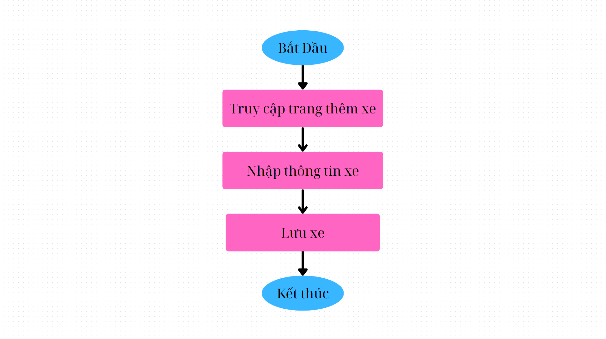
---

### 2. Chức năng sửa thông tin xe

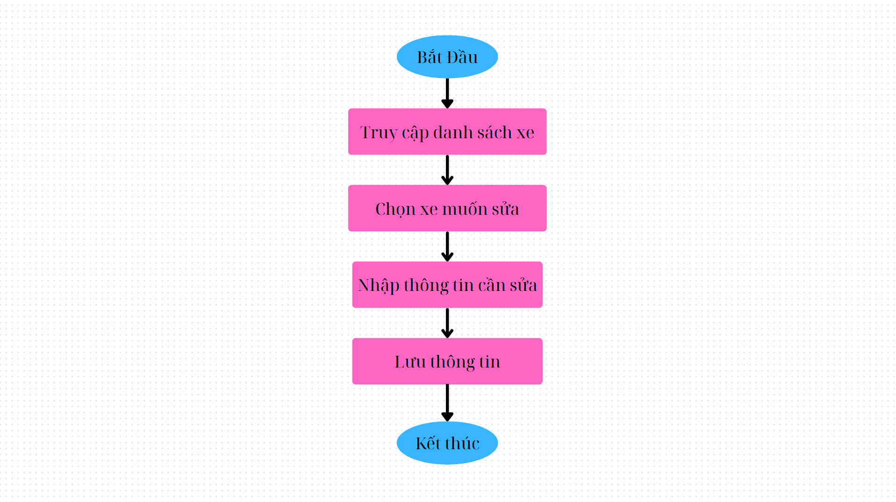
---

### 3. Chức năng xóa xe
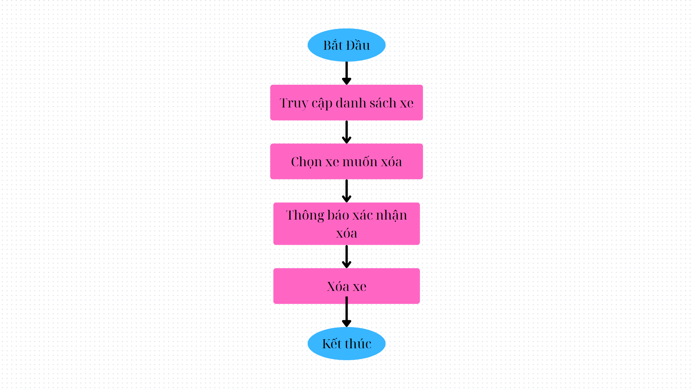
---

### 4. Chức năng xem thông tin chi tiết xe
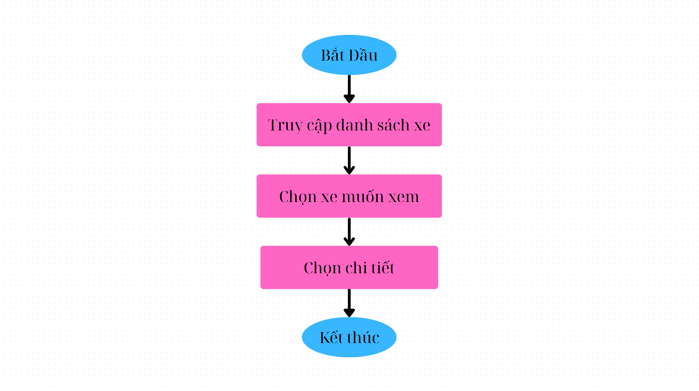
---

### 5. Chức năng tìm kiếm
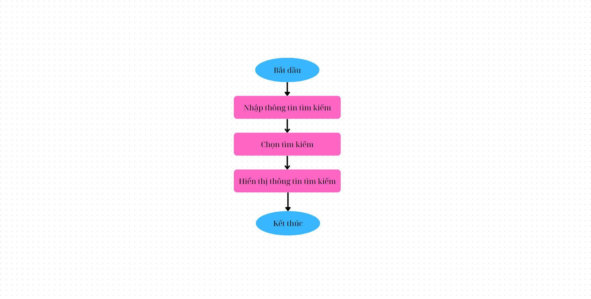
---

## 📸 Ảnh chụp màn hình

### Giao diện trang chính:
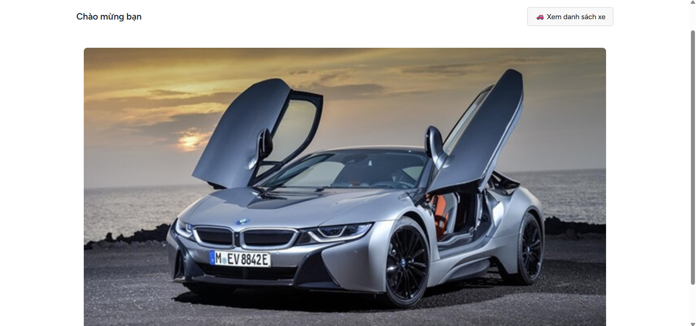

### Giao diện CRUD sản phẩm:
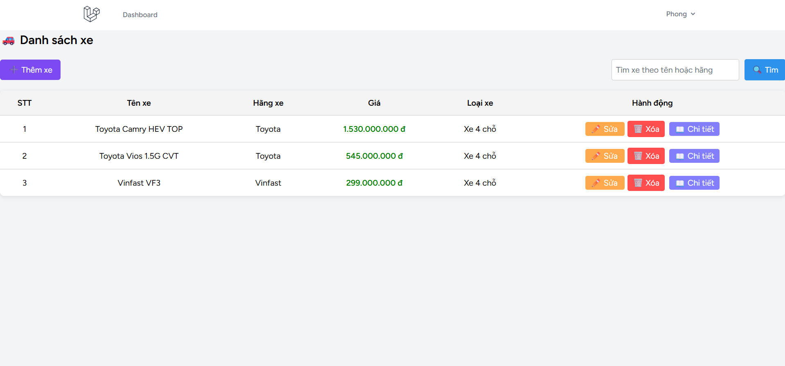

### Giao diện đăng nhập:
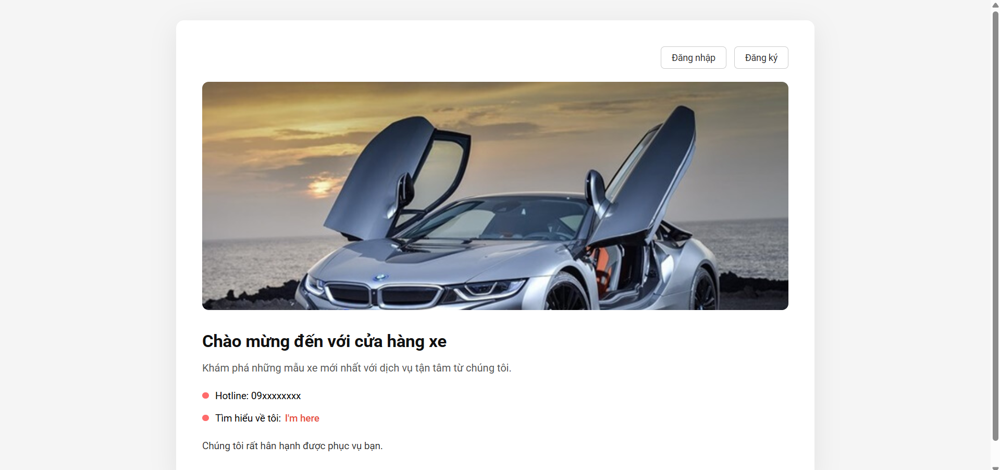

---

## 💻 Code minh họa phần chính
-  Models :  
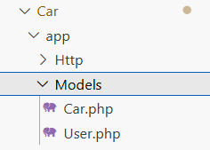
- Controller :  
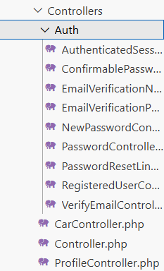
- View :    
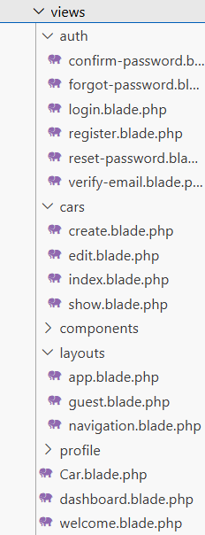
---

## Link Github Repository: 
[Truy cập dự án tại đây](https://github.com/phong1675/CarSell)
---

## Link deployment (public) web: 
[Website](https://potential-potato-v6wj6j6gpppqcx6pj-8000.app.github.dev/cars)
---

